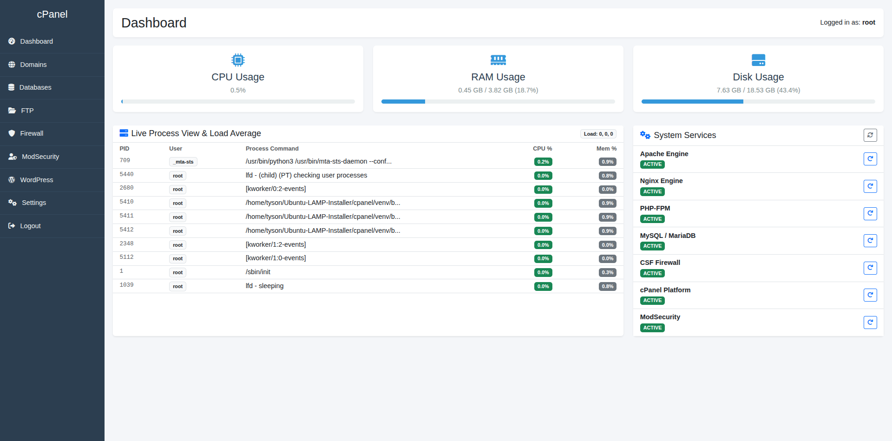

<p align="center">
  
</p>

<h1 align="center">Lite cPanel</h1>

<p align="center">
  A lightweight, open-source web hosting control panel for Linux servers.<br>
  Install a full LAMP/LEMP stack and manage your server from a clean, modern web interface.
</p>

<p align="center">
  
  
  
  
  
</p>

---

## Screenshot



---

## What is Lite cPanel?

**Lite cPanel** is a self-hosted, open-source server management panel built on Python (Flask). It is designed for developers and system administrators who need a simple, fast, and dependency-light alternative to heavy commercial control panels like cPanel/WHM or Plesk.

It bundles a full automated LAMP/LEMP stack installer alongside a browser-based management interface — all in a single deployable unit.

---

## Features

### 🖥️ Dashboard
- Real-time **CPU, RAM, and Disk** usage meters
- **Live Process View** — auto-refreshing top-10 process table with CPU/Memory percentages and 1/5/15-min load averages
- **System Services Monitor** — live status badges (Active / Inactive / Failed / Uninstalled) for Apache, Nginx, PHP-FPM, MySQL, MongoDB, Mongo Express, CSF Firewall, ModSecurity, and Lite cPanel itself
- One-click **Restart** button for each service directly from the dashboard

### 🌐 Domain Manager
- Add and remove Apache/Nginx virtual hosts with a single click
- Enable/Disable individual domains without deleting them
- **SSL Certificate management** — generate and renew Let's Encrypt certificates per domain
- Per-domain **log viewer** with live tail (Apache Error, Apache Access, Nginx Error, Nginx Access, Syslog)

### 🗄️ Database Manager
- Create MySQL/MariaDB databases with a dedicated user and strong password
- **Safe delete** — automatically removes the associated MySQL user when a database is deleted (or revokes only the specific grants if the user is shared)
- Change database user passwords from the panel
- Toggle user host access between `localhost` (local-only) and `%` (remote access)
- One-click **phpMyAdmin login** via secure single-sign-on token bridge

### 📁 FTP Manager
- Create and delete Pure-FTPd virtual FTP users
- Change FTP user passwords
- Bind FTP users to specific web root directories with path traversal prevention

### 🍃 MongoDB Manager
- **One-click installer** — installs MongoDB 8.x directly from the official repository
- Create MongoDB databases with a dedicated user and strong password
- Drop databases and automatically clean up associated users
- Change database user passwords from the panel
- **Mongo Express** — install, start, restart, and access the web-based MongoDB admin UI (`/mongo-express`) with auto-generated credentials and Apache reverse proxy

### 📂 File Manager
- Browse the full server filesystem from the browser with breadcrumb navigation
- Upload files (multiple at once) and download any file
- Create folders, rename and delete files/folders
- Edit text files, configs, and code directly in-browser with a full-height editor
- **Compress** — select multiple files/folders and archive them as `.zip`, `.tar.gz`, `.tar.bz2`, or `.tar.xz`
- **Extract** — decompress any archive (`.zip`, `.tar.gz`, `.tar.bz2`, `.tar.xz`, `.tar`, `.gz`, `.bz2`, `.xz`) in one click
- Path traversal and forbidden directory protection (`/proc`, `/sys`, `/dev`, etc.)

### 🛡️ Firewall (CSF)
- Start, Stop, and Restart ConfigServer Security & Firewall (CSF)
- Allow/Deny IP addresses with a single click
- View and manage temporary allow/deny entries
- Edit the raw `csf.allow`, `csf.deny`, `csf.ignore`, and `csf.conf` files in-browser
- Live port overview

### 🔒 ModSecurity (WAF)
- **One-click installer** — installs `libapache2-mod-security2` + OWASP Core Rule Set directly from the panel with a live progress bar
- Switch between **On / Detection-Only / Off** rule engine modes globally
- Toggle ModSecurity per-domain
- Activate rule profiles (OWASP CRS, Comodo WAF, Custom Rules)
- Edit main config, custom rules, and disabled rules list in-browser
- Live audit log viewer with domain filtering

### 🌟 WordPress Manager
- Auto-install WordPress on any configured domain with an optional sub-path
- Live streaming **progress bar** during installation
- Creates a secure, isolated MySQL database and user — credentials stored **only** in `wp-config.php`
- Detect existing and partial/broken WordPress installations
- One-click **Uninstall** — drops the WordPress database/user and removes all WordPress-specific files

### 🚀 Next.js & Node.js Manager
- **Node.js Process Manager** — Full graphical interface for **PM2**
- **Live Monitoring** — Real-time CPU, Memory, and Uptime tracking for background Node.js applications
- **Lifecycle Controls** — Start, Stop, Restart, and Delete processes with one click
- **Integrated Log Viewer** — View stdout/stderr logs in a beautiful modal for instant debugging
- **One-Click Startup** — Quickly launch Next.js apps on custom ports with automatic persistence
- **NVM Awareness** — Automatically detects and supports Node.js versions installed via NVM

### 🌐 Domain & SSL Manager
- **Smart SSL Generation** — Automatically detects which webserver (Apache/Nginx) is serving port 80 to choose the correct Certbot plugin
- **DNS Verification** — Automatically verifies DNS resolution for the `www` subdomain before including it in the SSL request, preventing validation failures
- **Snap Certbot** — Uses the official, more robust Snap-based Certbot installation method
- **Domain-Specific Logs** — Enhanced per-domain log viewer with live tailing and fallback support
- **Reverse Proxy** — Automatically generate Nginx/Apache reverse proxy configurations for Next.js applications
- **Inline Editor** — Advanced configuration editor with built-in SSL generation support

### 📊 Web Traffic Analytics (GoAccess)
- **Real-time Monitoring** — Integrated GoAccess engine for live parsing of Nginx and Apache access logs
- **Traffic Overview** — Per-domain hits, unique visitors, and bandwidth usage statistics
- **Deep-Dive Reports** — One-click generation of full interactive HTML reports for every domain
- **Automated Log Mapping** — Automatically detects log locations for proxy domains and Next.js applications

### 💻 Web-based Terminal
- Fully interactive root shell directly in the browser (via xterm.js)
- Real-time bi-directional communication over WebSockets (flask-sock)
- **Slick Modern UI** — Custom minimalist scrollbars and improved terminal container styling
- Automatic terminal resizing and window management
- Run interactive console tools like `nano`, `htop`, or `top` natively

### 🕒 Cron Job Manager
- View, add, and delete system scheduled tasks directly from the UI
- Beginner-friendly dropdown scheduler (Minute, Hour, Day, Month, Weekday)
- **1-Click Let's Encrypt auto-renewal setup**
- Safely parses and preserves existing cron comments and advanced macros

### 💾 Backup Manager
- Automate scheduled backups via cron or trigger manual backups instantly
- Generates precise, individual database dumps and domain-specific archives
- **Local Storage:** Keep backups locally with automated retention rules to save disk space
- **Remote Storage:** Upload backups securely to external FTP servers or S3-compatible object storage (e.g., DigitalOcean Spaces, AWS S3)

### 🔄 Panel Updater
- Built-in updater to seamlessly pull the latest features and bug fixes via Git directly from the UI

### ⚙️ Settings
- Edit core system configuration files (Apache, Nginx, MariaDB, PHP, FTP) directly in-browser with auto-reload on save
- **System Log Viewer** — tabbed viewer for Apache Error/Access, Nginx Error/Access, Syslog, and MySQL Error logs with auto-scroll and one-click refresh

### 🔐 Security
- **System-user authentication** — PAM-based login using the server's existing Linux user accounts
- **Jailed SFTP (Chroot)** — Secure file transfer isolation for virtual users, preventing access to the root filesystem
- **Private Group Isolation** — Each user operates in a private group, ensuring total data privacy between accounts while maintaining web server compatibility
- **Automatic Security Hardening** — Global protection for `.env` and sensitive dotfiles, plus automatic disabling of directory indexing (Autoindex) across Nginx and Apache
- **Framework Optimization** — Automated permission management (770/660) specifically tuned for Laravel, WordPress, and other modern PHP applications
- **CSRF Protection** on all forms (Flask-WTF)
- **Session-based login** with configurable secret key
- **phpMyAdmin SSO** via secure time-limited token files
- **Credential-free panel** — database passwords for web apps are managed securely, never stored in plaintext shared files
- **File Manager path boundary enforcement** — all operations validated against forbidden system paths

---

## Supported Operating Systems

| OS | Version | Status |
|---|---|---|
| **Ubuntu** | 20.04 LTS (Focal) | ✅ Fully Supported |
| **Ubuntu** | 22.04 LTS (Jammy) | ✅ Fully Supported |
| **Ubuntu** | 24.04 LTS (Noble) | ✅ Fully Supported |
| **Debian** | 11 (Bullseye) | ⚠️ Mostly Compatible |
| **Debian** | 12 (Bookworm) | ⚠️ Mostly Compatible |
| Other Linux | Any | ❌ Not Tested |

> **Note:** The automated stack installer (`install.sh`) is written specifically for Ubuntu/Debian `apt`-based systems. The panel itself (Flask app) will run on any Linux distribution with Python 3.10+.

---

## Stack Options

The automated installer supports three web stack configurations:

| Stack | Web Server | PHP | Use Case |
|---|---|---|---|
| **LAMP** | Apache 2 | `mod_php` | Classic shared hosting setup |
| **LEMP** | Nginx | PHP-FPM | High-performance modern sites |
| **Hybrid** | Nginx (port 80) + Apache (port 8080) | PHP-FPM | Best of both — Nginx as proxy, Apache for `.htaccess` compatibility |

All stacks include **MariaDB**, **phpMyAdmin**, and optional **MongoDB**.

---

## Installation

### Requirements
- Ubuntu 20.04+ or Debian 11+
- Root or `sudo` access
- Internet connection
- Git

### Step 1 — Clone the repository

```bash
git clone https://github.com/tysonchamp/Lite-cPanel.git
cd Lite-cPanel
```

### Step 2 — Run the stack installer

```bash
sudo bash install.sh
```

The installer will:
1. Prompt you to choose your preferred web stack (LAMP / LEMP / Hybrid)
2. Install all required packages non-interactively
3. Configure Apache and/or Nginx with a default virtual host
4. Set up MariaDB with a secure root password
5. Install phpMyAdmin with auto-generated credentials
6. Deploy and start the Lite cPanel panel as a system service on port **2083**

### Step 3 — Access the panel

Open your browser and navigate to:

```
http://<your-server-ip>:2083
```

Log in with any **Linux system user** account on that server (e.g. your SSH username/password).

---

## Manual Panel Setup (without the stack installer)

If you already have a web stack and just want the panel:

```bash
cd cpanel
python3 -m venv venv
source venv/bin/activate
pip install -r requirements.txt

# Set a persistent secret key (recommended)
echo "FLASK_SECRET_KEY=$(openssl rand -hex 32)" > app/.env

# Run with Gunicorn (production)
gunicorn --worker-class gthread --threads 10 --timeout 3600 --workers 3 --bind 0.0.0.0:2083 app.cpanel:app

# Or for development only
python3 app/cpanel.py
```

---

## Project Structure

```
Lite-cPanel/
├── install.sh                  # Main orchestrator installer
├── scripts/
│   └── lamp-installer.sh      # Core LAMP/LEMP/Hybrid stack installer
├── cpanel/
│   ├── requirements.txt
│   └── app/
│       ├── cpanel.py           # Flask application & routing
│       ├── auth.py             # PAM authentication
│       ├── backup_mgr.py       # Automated Backup Manager (Local, FTP, S3)
│       ├── cron_mgr.py         # Cron job scheduling
│       ├── database_mgr.py     # MySQL management
│       ├── domains_mgr.py      # Virtual host management
│       ├── filemanager_mgr.py  # File Manager (browse, edit, upload, compress, extract)
│       ├── ftp_mgr.py          # Pure-FTPd user management
│       ├── modsec_mgr.py       # ModSecurity management & installer
│       ├── mongodb_mgr.py      # MongoDB & Mongo Express management
│       ├── nextjs_mgr.py       # Next.js Apps Manager (PM2 + proxy)
│       ├── run_backup.py       # Automated backup execution script
│       ├── security_mgr.py     # CSF Firewall management
│       ├── settings_mgr.py     # Config editor & log viewer
│       ├── terminal_mgr.py     # Web-based root terminal via WebSockets
│       ├── updater_mgr.py      # Git-based automated panel updater
│       ├── wordpress_mgr.py    # WordPress installer & manager
│       ├── static/
│       │   ├── logo.png        # Lite cPanel logo
│       │   └── favicon.png     # Browser favicon
│       └── templates/          # Jinja2 HTML templates
│           ├── dashboard.html
│           ├── domains.html
│           ├── databases.html
│           ├── mongodb.html
│           ├── filemanager.html
│           ├── ftp.html
│           ├── firewall.html
│           ├── modsecurity.html
│           ├── wordpress.html
│           ├── nextjs.html
│           ├── terminal.html
│           ├── cron.html
│           ├── backups.html
│           ├── settings.html
│           └── login.html
├── screenshot.png
└── README.md
```

---

## Contributing

Contributions are welcome! This project is fully open-source under the GPL-3.0 License.

1. Fork the repository
2. Create a feature branch: `git checkout -b feature/my-feature`
3. Commit your changes: `git commit -m "feat: add my feature"`
4. Push to your branch: `git push origin feature/my-feature`
5. Open a Pull Request

Please follow [Conventional Commits](https://www.conventionalcommits.org/) for commit messages.

---

## Roadmap

- [ ] Email server management (Postfix/Dovecot)
- [x] Automated backups (scheduled tar/mysqldump with remote upload)
- [ ] Multi-user support with role-based access control
- [x] Let's Encrypt auto-renewal via cron
- [ ] Docker containerization support
- [x] Web-based terminal (xterm.js integration)
- [x] MongoDB & Mongo Express management
- [x] File Manager with compress/extract support

---

## License

This project is licensed under the **GNU General Public License v3.0**.  
See the [LICENSE](LICENSE) file for full details.

---

## Author

**Tyson**  
📧 tyson.granger181@gmail.com  
🐙 [github.com/tysonchamp](https://github.com/tysonchamp)
